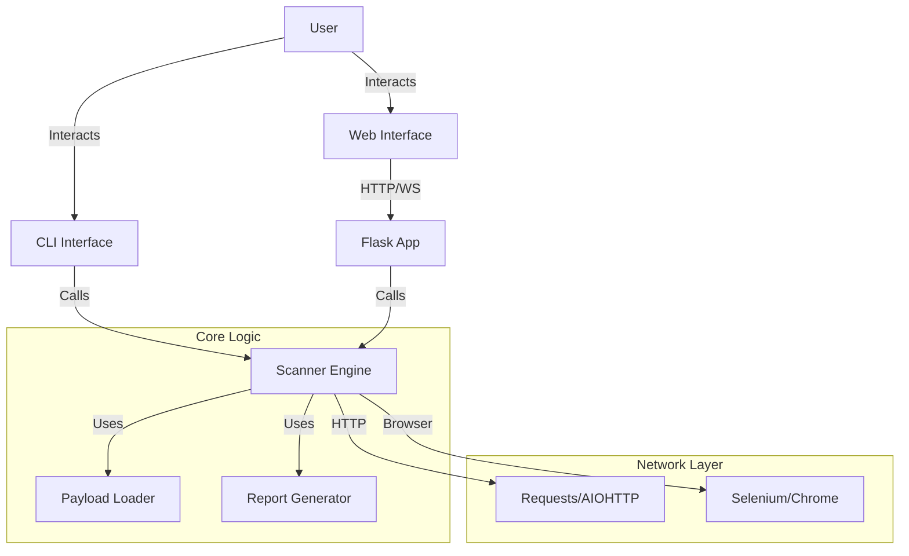

# 🎯 RaidScanner - Project Context

**Version**: 2.0 (Production Ready)  
**Last Updated**: 2025-12-05  
**Purpose**: Comprehensive context for AI assistants working with this codebase.

---

## 📋 Table of Contents

1. [Project Overview](#project-overview)
2. [Architecture](#architecture)
3. [Complete Project Structure](#complete-project-structure)
4. [Technical Implementation](#technical-implementation)
5. [Docker Implementation](#docker-implementation)
6. [Web API Documentation](#web-api-documentation)
7. [CLI Implementation](#cli-implementation)
8. [Security Considerations](#security-considerations)
9. [Usage Examples](#usage-examples)
10. [Performance Characteristics](#performance-characteristics)
11. [Development Guide](#development-guide)
12. [Dependencies](#dependencies)
13. [Version History](#version-history)
14. [Known Limitations](#known-limitations)
15. [DVWU Compatibility Tasks](#dvwu-compatibility-tasks)
16. [Future Enhancements](#future-enhancements)
17. [Configuration Reference](#configuration-reference)
18. [Testing Targets](#testing-targets)
19. [Legal Disclaimer](#legal-disclaimer)

---

## 🚀 Project Overview

**RaidScanner** is an advanced, automated web vulnerability scanner designed to detect LFI, SQLi, XSS, Open Redirect, and CRLF Injection vulnerabilities. It features a modern, modular architecture with both a Web GUI (Flask + WebSocket) and an interactive CLI (Rich).

**Global Project Status**: **Production Ready** ✅

### Core Features

| Feature | Status | Description |
|:---|:---:|:---|
| **LFI Scanner** | ✅ | Detection of Local File Inclusion vulnerabilities |
| **SQLi Scanner** | ✅ | Time-based blind & Error-based SQL detection |
| **XSS Scanner** | ✅ | Selenium-based detection with payload reflection checks |
| **Open Redirect** | ✅ | Header and JavaScript redirect detection |
| **CRLF Scanner** | ✅ | HTTP Response Splitting detection |
| **Web GUI** | ✅ | Modern dashboard with real-time updates via WebSocket |
| **CLI** | ✅ | Interactive terminal interface with live progress |
| **Reporting** | ✅ | detailed HTML and JSON reports |
| **Docker** | ✅ | Fully containerized deployment |

---

## 🏗️ Architecture

### Layered Design



### Data Flow

1. **Input**: User submits URLs via Web GUI or CLI.
2. **Processing**: `ScannerEngine` spawns background threads.
3. **Scanning**: Payloads are injected and responses analyzed.
4. **Feedback**: Progress sent via WebSocket (Web) or Rich (CLI).
5. **Output**: Reports generated in HTML/JSON.

---

## 📁 Complete Project Structure

```
raidscanner/
├── .docker/                        # Docker configuration
│   ├── Dockerfile
│   ├── compose.yml
│   └── .dockerignore
│
├── bin/                            # Binary executables
│   └── chromedriver-linux64/
│
├── core/                           # Core scanning logic
│   ├── scanner_engine.py           # Main scanning engine
│   ├── payload_loader.py           # Payload loading
│   └── report_generator.py         # Report generation
│
├── docs/                           # Documentation
│   ├── CONTEXT.md                  # LLM Context
│   ├── DEVELOPER_GUIDE.md          # Dev guide
│   └── USER_GUIDE.md               # User guide
│
├── output/                         # Raw scan output
├── payloads/                       # Payload text files
├── reports/                        # Generated reports
├── scripts/                        # Utility scripts
├── utils/                          # Helper modules
│   ├── config.py
│   └── platform_helper.py
├── web/                            # Web interface
│   ├── templates/
│   └── static/
├── app.py                          # Flask entry point
├── scanner_cli.py                  # CLI entry point
├── compose.yml                     # Docker Compose config
├── requirements.txt                # Python dependencies
└── requirements-docker.txt         # Docker specific deps
```

---

## 🔧 Technical Implementation

### Core Scanner Engine (`core/scanner_engine.py`)

#### LFI Scanner
- **Method**: HTTP request-based pattern matching
- **Process**: Injects payloads and checks response for success criteria patterns (case-insensitive).
- **Indicators**: Checks for "root:x:0:", "boot loader", and generic "path traversal detected" warnings.

#### SQLi Scanner
- **Method**: Hybrid (Time-based Blind + Error-based)
- **Process**:
  1. **Time-based**: Injects delay payloads (e.g., `SLEEP(10)`), measures response time.
  2. **Error-based**: Checks response body for specific SQL errors (e.g., "SQL Error", "syntax error", "detected injection attempt").

#### XSS Scanner
- **Method**: Selenium-based browser automation
- **Process**:
  1. Launches headless Chrome.
  2. Injects payload into URL.
  3. Checks for `alert()` execution.
  4. Fallback: Checks page source for raw payload presence (handling hybrid/encoded responses).
- **Optimization**: Limited to 3 concurrent threads.

#### Open Redirect Scanner
- **Method**: Header, Meta, and JavaScript analysis
- **Process**:
  1. Checks HTTP `Location` header.
  2. checks HTML `<meta refresh>` tags.
  3. Checks JavaScript `window.location` assignments.

#### CRLF Scanner
- **Method**: Header Injection detection
- **Process**: Injects CRLF sequences and checks response headers/cookies for injection.

---

## 🐳 Docker Implementation

- **Base Image**: `python:3.11-slim`
- **Browsers**: Google Chrome (Stable) + ChromeDriver
- **Display**: Xvfb for headless execution
- **Security**: Runs as non-root `scanner` user
- **Volumes**: Maps `output`, `reports`, `payloads`
- **Modes**:
  - `web`: Nginx/Flask app
  - `cli`: Interactive terminal

---

## 🌐 Web API Documentation

| Method | Endpoint | Description |
|:---|:---|:---|
| `POST` | `/api/scan/lfi` | Start LFI scan |
| `POST` | `/api/scan/sqli` | Start SQLi scan |
| `POST` | `/api/scan/xss` | Start XSS scan |
| `POST` | `/api/scan/or` | Start Open Redirect scan |
| `POST` | `/api/scan/crlf` | Start CRLF scan |
| `GET` | `/api/reports` | List generated reports |
| `GET` | `/api/payloads` | List available payloads |

**WebSocket Events**: `connect`, `scan_progress`, `scan_complete`, `scan_error`

---

## 💻 CLI Implementation

- **Library**: `rich` (UI), `prompt_toolkit` (Input)
- **Features**: 
  - Interactive menus
  - Live progress bars
  - Real-time result display
  - Report saving prompts

---

## 🔐 Security Considerations

- **Authorization**: Only scan authorized targets.
- **Rate Limiting**: Configurable thread levels to prevent DoS.
- **Input Validation**: All inputs sanitized.
- **Docker**: Isolated environment.

---

## 🎓 DVWU Compatibility Tasks

This section outlines tasks for the **Damn Vulnerable Web University (DVWU)** repository to ensure full compatibility with RaidScanner's current capabilities. Since RaidScanner primarily targets GET requests, some DVWU endpoints need adjustment for effective demonstration.

### Recommended DVWU Updates

1.  **Enable GET Requests for Portal (SQLi)**
    *   **Current**: Only accepts POST requests
    *   **Task**: Allow GET requests to trigger the SQLi check for demonstration
    *   **File**: `api/portal.js`

2.  **Enable GET Requests for Newsletter (CRLF)**
    *   **Current**: Only accepts POST requests
    *   **Task**: Allow GET requests (e.g., `?email=...`) to trigger CRLF check
    *   **File**: `api/newsletter.js`

3.  **Enable GET Requests for Stored XSS**
    *   **Current**: Stored XSS endpoint only parses POST body
    *   **Task**: Allow `?comment=...` via GET even for the stored XSS logic
    *   **File**: `api/comments.js`

### RaidScanner Enhanced Capabilities
The following scanning capabilities have been upgraded to specifically detect DVWU vulnerabilities without server-side changes:

1.  **Error-Based SQLi**: Now detects "detected injection attempt" and "SQL Error" strings, allowing detection of the Search endpoint (GET).
2.  **Client-Side Open Redirects**: Now parses JavaScript `window.location` assignments, enabling detection of the Redirect endpoint.
3.  **LFI Case-Insensitivity**: Improved detection logic for mock LFI responses.

---

## 🚧 Known Limitations

1. **POST Scanning**: Current scanner engine primarily supports GET parameter injection.
2. **XSS Performance**: Slower due to browser overhead.
3. **Authentication**: No login support for target sites.
4. **Database**: No persistent scan history.

---

## 🎯 Future Enhancements

1. **Authentication Support** (Login flows)
2. **POST Request Scanning**
3. **Database Integration** (Scan history)
4. **Distributed Scanning**
5. **Additional Scanners** (XXE, SSRF)

---

## 📝 Configuration Reference

- **Threads**: Default 5 (Configurable 1-10)
- **Timeout**: Default 10s
- **Env Vars**: `MODE` (web/cli), `PORT`, `HOST`

---

## 🧪 Testing Targets

- **DVWU** (Damn Vulnerable Web University)
- **DVWA** (Damn Vulnerable Web App)
- **OWASP WebGoat**
- **TestPHP Vulnweb**

---

## ⚖️ Legal Disclaimer

**Usage of this tool for attacking targets without prior mutual consent is illegal.** It is the end user's responsibility to obey all applicable local, state, and federal laws. Developers assume no liability and are not responsible for any misuse or damage caused by this program.
